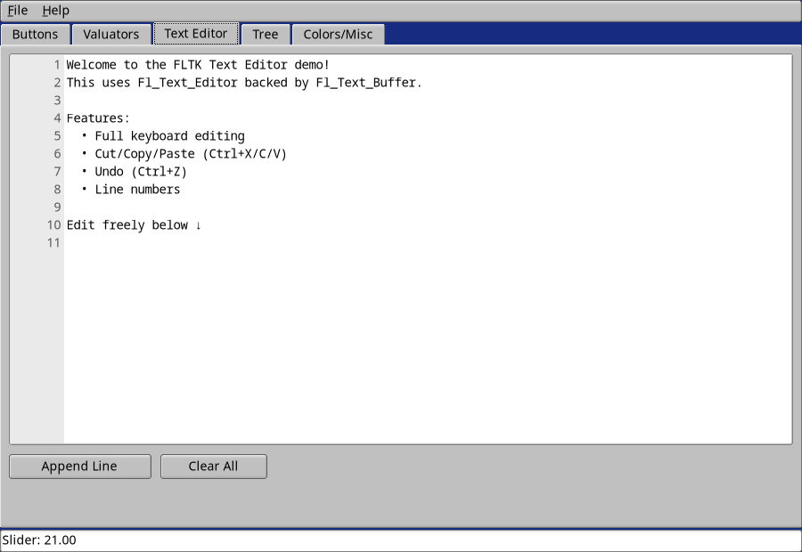
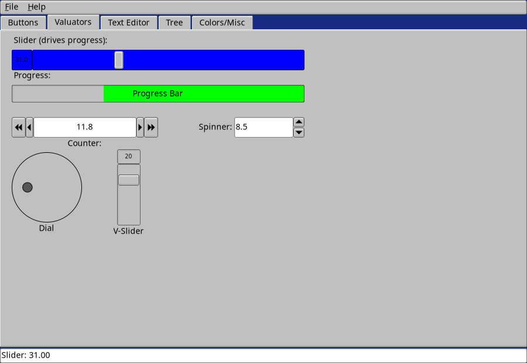

# nimFLTK

A complete Nim binding for the **FLTK** (Fast Light Toolkit) C++ GUI library.  
Optimized for **Nim v2.2.8+**, supporting cross-platform compilation on **Linux (Fedora, Debian, Arch)** and **Windows (MSYS2/UCRT64)**.

## ✨ Key Features
- 🎯 **Procedural API**: All functions follow `funcName(widget, args)`. The dot operator (`.`) is strictly reserved for object field access.
- 📦 **Comprehensive Widget Set**: Buttons, inputs/outputs, sliders, progress bars, tabs, text editor, tree views, menus, and native dialogs.
- ⚙️ **Auto-Configuration**: Compiler and linker flags are automatically resolved via `fltk-config`. No manual header/library paths required.
- 🛡 **Type-Safe Casting**: Explicit `asWidget()` helpers safely upcast derived pointers (`ptr FlButton`, etc.) to the base `ptr FlWidget`.
- 📝 **Convenience Templates**: `withWindow`, `withGroup`, `withTabs`, `withScroll`, `withPack`, and `withTile` automatically wrap code in `beginGroup()` / `endGroup()`.


## How it looks on Fedora Linux





## 📦 Installation
Ensure FLTK development libraries are installed and `fltk-config` is in your `PATH`.

```bash
# Fedora Linux
sudo dnf install fltk-devel

# Debian / Ubuntu
sudo apt install libfltk1.3-dev

# Arch Linux
sudo pacman -S fltk

# MSYS2 / Windows (UCRT64 environment)
pacman -S mingw-w64-ucrt-x86_64-fltk


